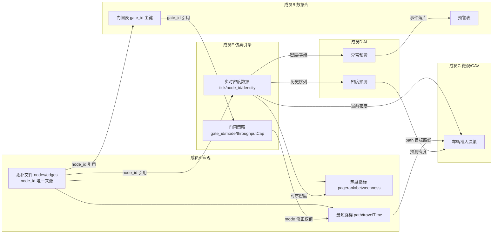

# 8.2 接口字段对接清单（成员A 参会准备）

> 成员 A（姚晨）｜日期：2026-08-01 准备，8.2 上午使用
>
> 会议：协作1「接口字段汇总定稿」——B（张紫桐）主持，全员参加，E（廖思颖）旁听
>
> 产出目标：冻结交通网络接口字段与拓扑文件方案，B 写入《交通网络接口.md》，冻结后变更需全员同意

---

## 〇、A 明天角色一句话

A 是**拓扑与热度数据源**：带交通网络 4 个接口的字段定义 + 园区拓扑文件方案去冻结；同时与 F 钉死 node_id 唯一来源，与 C 对齐宏观路径输出。

## 一、给 B（张紫桐 · 后端/数据库）——核心交付

### 1.1 交通网络接口字段（A→B，主交付，对应设计文档 §3.x）

**① 节点监控接口** `GET /api/v1/network/nodes`

| 字段（REST 层 camelCase） | 类型 | 含义 | 来源 |
|---|---|---|---|
| nodeId | str | 节点编码（**全园区唯一**） | A 拓扑 |
| nodeName | str | 节点名称（如"食堂"） | A 拓扑 |
| x / y | float | 地图坐标（支撑 E 画点位） | A 拓扑 |
| type | str | 节点类型：entrance / cross_road / divergence / hotspot / stop | A 拓扑 |
| people / density / level | int / float / str | 实时人流（low/medium/high/critical） | **F 实时数据，B 合并** |

JSON 样例（B 冻结用）：

```json
{
  "nodeId": "zone_canteen",
  "nodeName": "食堂",
  "x": 460,
  "y": 180,
  "type": "hotspot",
  "people": 1200,
  "density": 0.8,
  "level": "high",
  "gateId": "G01",
  "signalId": "S01",
  "edgeIds": ["E05", "E14"]
}
```

**② 路段热度指标接口** `GET /api/v1/network/hotness`（FR-08 输出）

| 字段 | 类型 | 含义 |
|---|---|---|
| nodeId | str | 节点编码 |
| pagerank | float | PageRank 得分（0~1） |
| betweenness | float | 中介中心性 |
| heatScore | float | 综合热度分（0~100，算法归一化） |
| rank | int | 热度排行（1 = 最热） |

JSON 样例：

```json
{
  "nodeId": "zone_canteen",
  "pagerank": 0.21,
  "betweenness": 156.4,
  "heatScore": 92.5,
  "rank": 1
}
```

**③ 最短路径查询接口** `GET /api/v1/network/shortest-path?src=&dst=`（FR-07 输出）

| 字段 | 类型 | 含义 |
|---|---|---|
| src / dst | str（请求参数） | 起终点 nodeId |
| path | str[] | 途径节点列表（含起终点） |
| travelTime | float | 通行时间（分钟，边权值之和） |

JSON 样例：

```json
{
  "src": "gate_north",
  "dst": "zone_canteen",
  "path": ["gate_north", "cross_1", "diverg_1", "cross_4", "zone_canteen"],
  "travelTime": 6.2
}
```

**④ 热点区域分析接口** `GET /api/v1/network/hotspots`（FR-09 输出）

| 字段 | 类型 | 含义 |
|---|---|---|
| region | str | 热点区域标识 |
| nodeIds | str[] | 该区域覆盖的节点 |
| attractScore | float | AttractRank 吸引度得分 |

JSON 样例：

```json
{
  "region": "canteen_area",
  "nodeIds": ["zone_canteen", "cross_4"],
  "attractScore": 88.0
}
```

### 1.2 从 B 接收（只确认，不产字段）

- 统一响应结构 `{code, message, data}`
- 认证 token（Header: `Authorization: Bearer <token>`）
- REST 字段命名：**小写驼峰**（`nodeId` / `heatScore`）
- 时间格式、分页约定

## 二、与 F（张丹 · 仿真引擎）——双向对齐（协作3 伏笔）

| 方向 | 字段 | 含义 |
|---|---|---|
| A→F | 拓扑文件：nodes（node_id / x / y / type）+ edges（from / to / weight / capacity） | F 引擎加载同一份拓扑文件 |
| F→A | 全节点时序密度（tick / node_id / density） | A 算 PageRank/中介中心性验证热点 |

> **关键（必须钉死）**：`node_id` 编码以 A 的拓扑文件为**唯一来源**，F 引擎加载同一份文件，任何人不得私自新增/改名节点。拓扑文件存放：`工作区/AAA组长 火之晨曦/topology.yaml`（随代码提交 GitHub，F/D/E 从仓库拉取）。

### 2.1 门闸字段对齐（F 的 GatePolicyController ↔ A 拓扑）

| 项 | F（张丹）产出 | A（姚晨）拓扑 | 对齐要求 |
|---|---|---|---|
| 门闸编号 | `gate_id`（策略输出主键） | 入口节点 `gate_id` 字段（引用） | **编码统一，以 B 门闸表为唯一来源** |
| 闸状态 | `mode`: open / restrict / close | 不产出，**消费** | 限流/关闭 → 相邻边权值上调 |
| 放行上限 | `throughput_cap` | 不产出，影响权值修正幅度 | — |
| 开闸数 | `n_lanes` | 不产出 | — |

> **gate_id 挂到 node_id**：门闸属于入口节点，门闸表记录 gate_id ↔ node_id 映射（B 建表维护），A 拓扑只在 entrance 节点引用 gate_id。
>
> 依赖链：`F 策略(restrict) → A 的 effective_weight(edge) 上调 → Dijkstra 绕行 → C 车辆走新路`

## 三、与 C（陈思敏 · 微观/CAV）——双向对齐（协作4 伏笔）

| 方向 | 字段 | 含义 |
|---|---|---|
| A→C | 最短路径输出：path（nodeId 列表）/ travelTime / dst | C 的 CAV 车辆目标路线 |
| C→A | 车辆实际通行统计（可选） | 反馈修正边权值（动态权值伏笔） |

> 动态权值说明：边 weight 为静态通行时间，后续可按实时密度×拥堵系数修正（宏观识别密集区 → 权值上调），此机制与 F 的联合调控闭环衔接。

## 四、与 E（廖思颖 · 前端大屏）——旁听确认

E 明天旁听、主要领 B 的 REST 文档。A 需确保：
- `node_id` + `x` / `y` → 地图点位与连线
- `hotness`（rank / heatScore）→ 热度排行展示
- `hotspots` → 热点区域标红

## 五、明天必须带走的三件事

1. **冻结版本**：讲清 §1.1 四个接口的字段名/类型/取值枚举，请 B 写入《交通网络接口.md》并冻结。
2. **node_id 唯一来源钉死**：与 F 敲定拓扑文件交接方式（文件位置、格式、版本管理）。
3. **命名约定**：引擎内部 snake_case（`node_id`）→ REST 冻结 camelCase（`nodeId`），转换层建议由 B 后端负责。

## 六、数据/表依赖关系图



**唯一来源清单**：

| 字段 | 唯一来源 | 责任人 |
|---|---|---|
| `node_id` | 拓扑文件 nodes | A（姚晨） |
| `gate_id` | 门闸表 | B（张紫桐） |
| 时序密度/门闸策略 | 仿真引擎 | F（张丹） |

---

## 附：园区拓扑文件示例方案（约 12 节点小园区）

### 数据结构定义（`TrafficNetwork` 类草图）

```python
@dataclass
class TopoNode:
    id: str        # node_id，全园区唯一（钉死）
    x: float       # 地图坐标
    y: float
    type: str      # entrance / cross_road / divergence / hotspot / stop
    gate_id: str = ""   # 门闸编号（仅 entrance 节点，引用 B 门闸表；其余节点为空）

@dataclass
class TopoEdge:
    src: str       # 起点 node_id
    dst: str       # 终点 node_id
    weight: float  # 静态通行时间（分钟）
    capacity: int  # 通行能力（人/分钟）

class TrafficNetwork:
    """加载 topology.yaml → 邻接表；提供 get_node / neighbors / add_edge 等接口"""
    def __init__(self, path: str = "topology.yaml"): ...
    def load(self) -> "TrafficNetwork": ...   # 读配置文件建图
    # 后续 Dijkstra（ShortestPathFinder）/ PageRank（TrafficNetworkAnalyzer）在此图上运行
```

### topology.yaml 示例

```yaml
nodes:
  - { id: gate_north,   x: 60,  y: 40,  type: entrance, gate_id: G01 }   # 北门
  - { id: gate_west,    x: 60,  y: 260, type: entrance, gate_id: G02 }   # 西门
  - { id: cross_1,      x: 200, y: 100, type: cross_road }    # 一号路口
  - { id: cross_2,      x: 340, y: 100, type: cross_road }    # 二号路口
  - { id: cross_3,      x: 200, y: 220, type: cross_road }    # 三号路口
  - { id: cross_4,      x: 340, y: 220, type: cross_road }    # 四号路口
  - { id: diverg_1,     x: 270, y: 160, type: divergence }    # 中心分歧点
  - { id: zone_canteen, x: 460, y: 180, type: hotspot }       # 食堂（热点上下车区）
  - { id: zone_library, x: 140, y: 160, type: hotspot }       # 图书馆
  - { id: zone_gym,     x: 460, y: 60,  type: hotspot }       # 体育馆
  - { id: zone_dorm,    x: 140, y: 60,  type: hotspot }       # 宿舍区
  - { id: stop_south,   x: 270, y: 320, type: stop }          # 南门公交站

edges:
  - { src: gate_north,  dst: cross_1,      weight: 2.0, capacity: 120 }
  - { src: cross_1,     dst: cross_2,      weight: 2.5, capacity: 100 }
  - { src: cross_1,     dst: diverg_1,     weight: 1.5, capacity: 90 }
  - { src: cross_2,     dst: diverg_1,     weight: 1.5, capacity: 90 }
  - { src: cross_2,     dst: zone_canteen, weight: 1.2, capacity: 80 }
  - { src: cross_2,     dst: zone_gym,     weight: 1.8, capacity: 70 }
  - { src: cross_1,     dst: zone_dorm,    weight: 2.0, capacity: 80 }
  - { src: cross_1,     dst: zone_library, weight: 1.5, capacity: 70 }
  - { src: gate_west,   dst: cross_3,      weight: 2.0, capacity: 120 }
  - { src: cross_3,     dst: cross_4,      weight: 2.5, capacity: 100 }
  - { src: cross_3,     dst: diverg_1,     weight: 1.5, capacity: 90 }
  - { src: cross_4,     dst: diverg_1,     weight: 1.5, capacity: 90 }
  - { src: cross_3,     dst: zone_library, weight: 1.8, capacity: 70 }
  - { src: cross_4,     dst: zone_canteen, weight: 1.2, capacity: 80 }
  - { src: diverg_1,    dst: stop_south,   weight: 2.5, capacity: 110 }
  - { src: zone_dorm,   dst: zone_gym,     weight: 3.0, capacity: 50 }
  - { src: zone_gym,    dst: zone_canteen, weight: 2.2, capacity: 60 }
```

> 说明：以上为示例园区（4 入口类型 + 6 十字路口/分歧点 + 4 热点 + 1 公交站），节点数/坐标/权值可在 8.2 会议后按园区实际情况调整，**一旦冻结即全员复用**。

### 简化假设（答辩备查）

- **红绿灯已纳入建模**：路口节点通过 `signalId` 引用红绿灯表（B 建表维护），相位状态影响 Dijkstra 边权
- **人车默认同路**：边不区分行人道/车行道，人流车流共用同一拓扑
