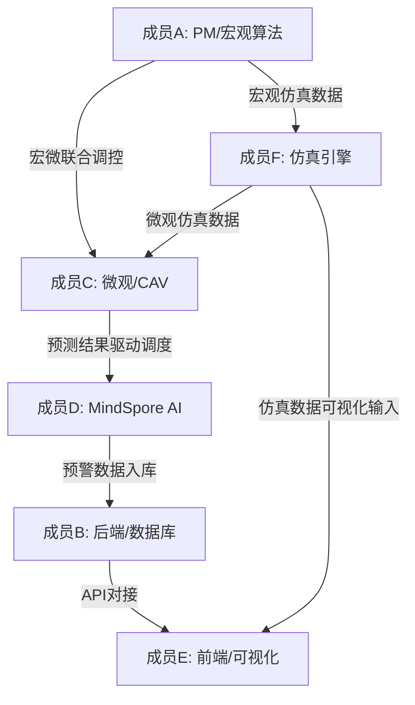

# 基于MindSpore的园区安全智能调控平台 — 分工总结文档

## 一、项目概述

本项目旨在构建一个基于MindSpore的园区安全智能调控平台，实现园区人流实时监测、门闸动态调节、外来车辆准入智能判断、拥堵风险预警与应急响应等功能。系统需兼顾宏观交通拓扑网络分析与微观车联网交通汇合（MAS+CAV）两个层面，支撑3000人以上正常运行。

**技术栈：** MindSpore + 昇腾硬件 + ModelArts / Django + DRF（后端）+ Vue/React（前端）+ MySQL/PostgreSQL（数据库）/ GitHub + 飞书（协作管理）

**截止时间：** 2026年8月8日中午12:00

---

## 二、团队分工

### 成员A：项目经理 / 宏观算法负责人

| 维度 | 内容 |
|------|------|
| **核心职责** | 整体项目协调、进度管控、宏观算法研发 |
| **开发任务** | 交通拓扑网络构建（十字路口、道路分歧点、上下车热点作为关键节点，设计节点、边及权值）；实现Dijkstra最短路径算法；PageRank与中介中心性热点分析；AttractRank算法的参考实现；统一算法接口规范（遵循sklearn风格） |
| **文档任务** | 编写《设计文档》（整体架构、模块划分、技术选型）；在飞书上每日维护《开发进度文档》；汇总最终《分工总结文档》 |
| **协作对象** | 与成员F对接宏观仿真数据；与成员C对接宏微联合调控逻辑 |

---

### 成员B：后端开发 / 数据库负责人

| 维度 | 内容 |
|------|------|
| **核心职责** | 后端架构、数据库设计与实现、系统安全 |
| **开发任务** | 管理员系统（注册、登录、查看等CRUD接口）；RESTful API设计与实现；数据库设计与建表（用户表、车辆表、节点表、门闸表、日志表等，遵循第三范式避免冗余）；系统安全防护（防SQL注入、XSS攻击、接口限流、恶意访问检测） |
| **文档任务** | 编写《前后端接口文档》（建议使用Swagger自动生成或手写Markdown）；参与设计文档中后端架构部分 |
| **协作对象** | 与成员E进行前后端联调；与成员D对接预警数据入库API |

---

### 成员C：微观仿真 / 车联网（CAV）负责人

| 维度 | 内容 |
|------|------|
| **核心职责** | 微观层面多智能体仿真、车联网一致性模拟 |
| **开发任务** | MAS多智能体系统搭建（车辆智能体、门闸智能体）；CAV车联网一致性模拟（多年辆协同汇合，验证通行效率提升）；车辆准入算法（根据园区内人流密度规划行进路线或限制入内）；差分隐私（DP）保护车辆行驶路径等敏感数据 |
| **文档任务** | 撰写CAV提速效果量化分析（对比有无CAV的通行效率数据）；编写微观仿真模块设计说明 |
| **协作对象** | 与成员A对接宏微联合调控；与成员D对接预测结果驱动车辆调度 |

---

### 成员D：MindSpore AI / 预测与预警负责人

| 维度 | 内容 |
|------|------|
| **核心职责** | 基于MindSpore的AI模型开发、安全预警、昇腾集成 |
| **开发任务** | 使用MindSpore构建人流密度预测模型；异常检测算法（拥堵识别、滞留人员监测、门闸状态异常）；使用ModelArts进行模型部署；昇腾硬件集成（将硬件视为小车，结合计算机视觉实现本地道路情况建模）；安全预警与应急响应模块逻辑 |
| **文档任务** | 编写AI模型设计文档（模型选型、训练方案、评估指标）；编写昇腾集成说明 |
| **协作对象** | 与成员C对接预测结果输出；与成员B对接预警数据存储与API |

---

### 成员E：前端 / 可视化负责人

| 维度 | 内容 |
|------|------|
| **核心职责** | 前端界面开发、数据可视化大屏 |
| **开发任务** | 管理后台页面搭建（登录注册、数据管理、系统配置）；可视化大屏（实时人流热力图、道路人员密度、密度预测曲线、车辆准入状态）；用户交互设计（地图区域点击、节点详情弹窗、筛选与缩放）；前端状态管理与路由设计 |
| **文档任务** | 编写前端设计说明；参与接口文档中前端对接部分 |
| **协作对象** | 与成员B进行前后端API联调；与成员F对接仿真数据可视化输入 |

---

### 成员F：仿真引擎 / 数据生成 / 扩展性负责人

| 维度 | 内容 |
|------|------|
| **核心职责** | 仿真核心引擎开发、宏观-微观联合调控 |
| **开发任务** | 核心仿真引擎（支撑3000+人/车同时模拟，保障性能）；随机人流与车辆数据生成器（可配置密度、时段分布）；宏观-微观联合调控逻辑（宏观识别人流密集区域 → 分配更多计算资源给微观 → 微观反馈路径优化结果到宏观）；动态门闸控制算法（根据人流数据自动调节开关策略）；系统扩展性设计与性能优化 |
| **文档任务** | 编写仿真引擎设计说明（含压力测试方案与结果）；编写扩展性设计文档 |
| **协作对象** | 与成员A对接宏观算法数据；与成员E对接仿真数据可视化；与成员C对接微观仿真数据输入 |

---

## 三、分工协作关系图

## 四、开发时间线

| 日期 | 阶段 | 关键任务 |
|------|------|----------|
| 8.1 - 8.2 | 规划与设计 | 完成设计文档（成员A）、数据库设计（成员B）、接口定义（成员B）、项目脚手架搭建（全员） |
| 8.3 - 8.4 | 并行开发 | 宏观算法（A）、微观仿真（C）、AI模型（D）、前端页面（E）、仿真引擎（F）、后端接口（B）同步推进 |
| 8.5 - 8.6 | 模块联调 | 前后端联调（B+E）、宏微联合调控联调（A+C+F）、预警与后端联调（D+B）、可视化数据接入（E+F） |
| 8.7 | 整合测试 | 全流程测试、3000人压力测试、Bug修复、PPT初稿 |
| 8.8 上午 | 最终交付 | PPT定稿（成员A）、文档整理打包、邮箱提交 |

---

## 五、交付物清单

| 序号 | 交付物 | 主要负责人 | 参与人员 |
|------|--------|-----------|----------|
| 1 | 设计文档 | 成员A | 全员（各模块负责人提供各自内容） |
| 2 | 开发进度文档 | 成员A | 飞书每日更新 |
| 3 | 前后端接口文档 | 成员B | 成员E |
| 4 | 项目工程文件 | 全员 | GitHub仓库 |
| 5 | 分工总结文档 | 成员A | — |
| 6 | 答辩PPT | 成员A | 全员（每人提供负责模块的2-3页内容） |

---

## 六、协作规范

- **代码管理：** 使用GitHub进行版本管理，采用Feature Branch工作流（每人独立分支，通过Pull Request合并至main），提交信息需清晰注明修改内容
- **进度同步：** 每日在飞书中更新个人进度（完成项、进行中、遇到问题）
- **代码规范：** 变量函数命名遵循下划线命名法，类名遵循大驼峰命名法；各模块独立分包，架构清晰；算法接口统一遵循sklearn风格（fit / predict / transform）
- **会议安排：** 每日一次简短站会（15分钟内），同步进度与阻塞问题
